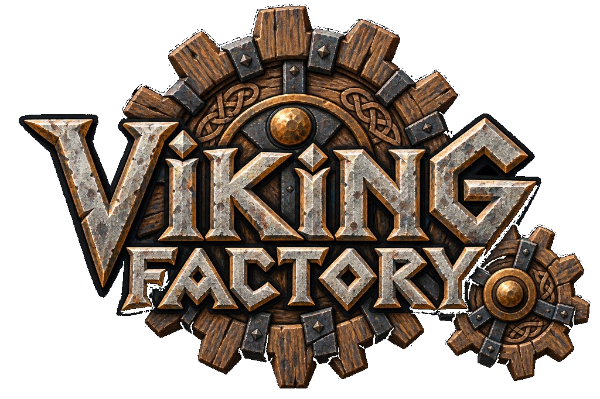

<p align="center">
  
</p>

<h1 align="center">VikingFactory</h1>

<p align="center">
  Mechanical workshops for Valheim, built like a Norse settlement invented them.
  <br>
  Timber frames, bronze and iron fittings, stone foundations, and machines that follow the game's own progression.
</p>

<p align="center">
  
  <br>
  <a href="ROADMAP.md">Roadmap</a>
  ·
  <a href="docs/Development.md">Development setup</a>
  ·
  <a href="docs/ImplementationStatus.md">What is actually built</a>
  ·
  <a href="CONTRIBUTING.md">Contributing</a>
  ·
  <a href="https://github.com/loafdaddy/VikingFactory/issues">Issues</a>
</p>

**Early development.** The public repository is [loafdaddy/VikingFactory](https://github.com/loafdaddy/VikingFactory). It is here so people can follow the work, share ideas, and help build it. It is not a release for players. There is no Thunderstore package, and nothing here has been played in a Valheim world.

VikingFactory is an automation mod for Valheim. The long-term aim is machinery for power, transport, processing, farming, forestry, mining, and cooking, where automation fits the world. Those are design goals. A model or a class name is not a working machine.

## Why this exists

I’m a big fan of Create for Minecraft, Satisfactory, Dyson Sphere Program, Factorio, and Anno, and of Valheim. VikingFactory started because I wanted that same enjoyment of building machines and production chains inside Valheim, without leaving the game’s materials, biomes, or progression behind. Development stays public for anyone who wants to follow along, share an idea, or contribute.

Valheim, and the games named above, are other people’s work. This project is not affiliated with them.

## What the machines are meant to be

Power and items stay separate. A shaft carries rotation. A belt is for goods. If a line asks for more drive than its wheels and cranks can give, it stalls, and you can see that it stalled.

Machines use the materials you already have: wood and hide first, then bronze and iron, then the later metals and stations the game already gates. They should speed up work you can already do. They should not invent new ores, skip a boss, or change how long a smelter or a crop takes.

The full target is written up as a design proposal in [`docs/VikingFactory-Master-Prompt.md`](docs/VikingFactory-Master-Prompt.md). [`DESIGN.md`](DESIGN.md) is an earlier outline. Where those two disagree, the master prompt is the target, and [`docs/ImplementationStatus.md`](docs/ImplementationStatus.md) is what exists today.

## What works today

Checked in code and by a headless game launch. No world was entered, and no piece was placed with the hammer.

- The plugin loads. Version `0.1.0`, BepInEx, Jötunn.
- Eight hammer pieces register: a workshop marker, hand crank, wooden shaft, clutch, water wheel, timber belt, bronze feeder, and catch basket.
- Those seven machines, other than the marker, load original GLB models. Material names are swapped at runtime for cloned Valheim shaders. The game’s own textures are not in this repository.
- A core simulation, covered by tests that do not start Valheim, runs one feeder from a crank and stalls when a second feeder is added. Shafts add no load. A closed clutch drops the branch beyond it.

Present in code, and not yet seen in a world: placing those pieces, spinning parts, a scrolling belt surface, a feeder moving a real item, and basket or clutch state saved on the piece.

Not gameplay yet: item-carrying belts, smelters, kilns, recipe crafting, farming, forestry, mining, cooking, steam, sail, and livestock. Some of those have models only. See the [roadmap](ROADMAP.md).

## Build and test

There is no player install. If you want to compile the current source:

```bash
cp Environment.props.example Environment.props
# Set VALHEIM_INSTALL in Environment.props to your local game. Do not commit that file.
./scripts/test.sh
./scripts/build.sh
```

`scripts/test.sh` runs the core tests. `scripts/build.sh` also compiles the plugin, which needs a local Valheim install, BepInEx, and Jötunn. Paths and versions are in [docs/Development.md](docs/Development.md).

## Known limits

- No in-game screenshots, save/load test, second client, or dedicated server.
- The belt draws a little power and can scroll its hide surface. It does not carry items.
- The water wheel can be placed only on the game’s water piece. Spacing and immersion are not checked.
- Multiplayer is not implemented as a tested feature. The intention is that the piece owner simulates, and that a factory stops when nobody is nearby. That has not been tried with two clients.
- Unity `6000.0.75f1` matches the current game player. No AssetBundle has been built.
- There is no license file yet. Do not treat the source as free to relicense or ship until one is added.

## Follow along

- Progress and priorities: [ROADMAP.md](ROADMAP.md)
- Engineering checklist: [docs/ImplementationStatus.md](docs/ImplementationStatus.md)
- Bugs and ideas: [GitHub Issues](https://github.com/loafdaddy/VikingFactory/issues), using the templates
- How to help: [CONTRIBUTING.md](CONTRIBUTING.md)

## Docs

| Doc | What it is |
|---|---|
| [ROADMAP.md](ROADMAP.md) | Current focus, next, later, and what “ready” would mean |
| [docs/Development.md](docs/Development.md) | Prerequisites, build, assets, multiplayer notes |
| [docs/ImplementationStatus.md](docs/ImplementationStatus.md) | Checked boxes for work that exists |
| [docs/Compatibility.md](docs/Compatibility.md) | Game, BepInEx, and Jötunn versions this tree was built against |
| [docs/Balance.md](docs/Balance.md) | The few power numbers the tests actually use |
| [CONTRIBUTING.md](CONTRIBUTING.md) | Bugs, proposals, and pull requests |

---

VikingFactory is developed with AI assistance, but most of the code is written by me.
